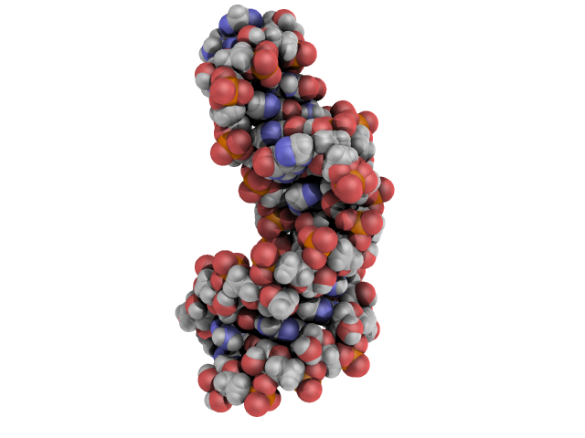

# Templates for writing and running PyMOL in RStudio.

[](https://opensource.org/licenses/MIT)


For details on installing the pymolpysnips library for **JupyterLab**, go to the [GitHub Page](https://mooerslab.github.io/jupyterlabpymolpysnips/) associated with this project.
For a list of the snippets and their descriptions, also go to the [GitHub Page](https://MooersLab.github.io/rstudiopymolpysnips/) associated with this project.

<a id="table-of-contents"><h2>Table of Contents</h2></a>

* [Motivation](#motivation)
* [New to scripting in PyMOL](#new)
* [Tech Stack](#technology-stack)
* [Installation](#installation)
* [Configuration Setup](#configuration-setup)
* [Usage](#usage)
* [Testing](#testing)
* [Requests for new snippets and text editors](#requests)
* [Bug reports](#bugreports)
* [Roadmaps](#roadmap)
* [License](#license)
* [Contact Information](#contact-information)
* [How to cite](#citation)


<a id="motivation"><h2>Motivations for this project</h2></a>

### Use rstudiopymolpysnips to be more productive while running PyMOL in RStudio


<p>The animation below demonstrates the use of the <b>ao</b> snippet in <em>RStudio</em> to insert 17 lines of code for generating the ambient occlusion effect.
The snippet will appear in a list of autosuggestions after entering the first several letters of its tab trigger.
Note that entering <b>ao</b> did not bring up the **ao** snippet.
I had to enter <b>aod</b> to bring up the <b>ao</b> snippet in the list.</p>

<p align="center"></p>

<p>The animation below shows the use of Knitr to convert the Rmarkdown document into a PDF file.</p>

<p align="center"></p>


The result of applying a variant of the above code to a 27-nucleotide RNA hairpin is shown below.

<p align="center"></p>

There is no option in a pulldown menu in **PyMOL** to apply the ambient occlusion effect. 
A script file with 17 commands is required.
This code can be applied to any molecular object that has been loaded into **PyMOL**.

[Return to Table of Contents](#table-of-contents)


### Why run PyMOL in  RStudio?

#### 1. R Markdown is very easy to learn.

The syntax for R Markdown is small and fast to master.


#### 2. Illustrate Rmarkdown with molecular images

You can illustrate your R Markdown documents with images created in **PyMOL**.
You can also adjust molecular images from within **RStudio** without opening **PyMOL**, thereby saving time.


#### 3. R Markdown is easy to edit in RStudio

The Rmarkdown documents have a gentle learning curve because they are easy to edit.
The code blocks can be run individually during the development of the code or the entire document can be compiled in one go by using **knitr**.


#### 4. Snippets for RStudio support tab triggers and tab stops

The snippet system in RStudio is similar to that in other leading IDEs and supports tab triggers and tab stops.
**Jupyter** does not yet support tab triggers and tab stops.


#### 5. Combine PyMOL output with statistical packages in R

The numerical output from structural analysis can be directly imported into R packages for further analysis.
The presence of output from PyMOl and R in the same document eases the tracking of the results and supports reproducible research.


#### 6. Streamlines the management of images for a project
The images generated by **PyMOL** can be stored in one **Rmarkdown** file as opposed to having dozens of script and image files sequestered in dozens of subfolders.
Using one file greatly eases finding the code to make a particular figure because the code and image can be next to each other. 
This ability to easily find the required code later reduces the resistance to remaking a figure for manuscript resubmission, journal cover artwork, posters, platform presentations, lectures, book chapters, review articles, websites, and wall hangings.

Using one file also eases the sharing of images with collaborators because only one file needs to be shared.
If the collaborators are not **PyMOL** or **RStudio** users, the notebook file can be reformatted as a PDF or HTML file.


#### 7. Facilitates combining PyMOL with other software in molecular structure analysis

Other software can be run from the same notebook during a molecular structure analysis project provided that this is R software or software with Python APIs.
This capability can improve the reproducibility of the computational aspects of your structural biology research.

[Return to Table of Contents](#table-of-contents)


### But I will miss the interactive viewport in PyMOL!

1. You can run the PyMOL GUI next to your **RStudio** session.
You can manually adjust the molecule's orientation, run the get_view command, copy the output in the command history window from PyMOL, and paste it into a cell in **RStudio**. 
The one line of settings returned by the **rv** shortcut is easier to copy and paste. 

2. You do not need the viewport. With 10-15 minutes of practice, you can master the rapid iterating of **rotate** and **translate** commands to adjust the molecule's orientation with greater precision than via manipulation of the mouse.

[Return to Table of Contents](#table-of-contents)


<a id="new"><h2>New to PyMOL scripting?</h2></a>

If you are not ready to write PyMOL scripts, please consider using [PyMOL shortcuts](https://github.com/MooersLab/pymolshortcuts) to enhance your productivity in **PyMOL** interactive sessions.
For example, the above ambient occlusion effect can be invoked at any time by entering **AO** at the **PyMOL>** prompt, if the *pymolshortcuts.py* file has been loaded.
These shortcuts can also be invoked in **RStudo** by submitting them as arguments to the cmd.do() method, (e.g., cmd.do("AO") to generate the ambient occlusion effect.)

## Application Description

The **rstudiopymolpysnips** library contains 260 code fragments (i.e, templates or snippets) written in Python to run PyMOL in **RStudio** via **PyMOL**'s **Python** API through the **reticulate** package.
This API is only available for recent versions of **PyMOL** that depend on Python3 from Anaconda.
This API is available for both the incentive and open-source versions of **PyMOL**.
A conda env with Python 3.6 or later as the default Python interpreter is required.
**PyMOL** must be installed in this conda env.

[Return to Table of Contents](#table-of-contents)


<a id="technology-stack"><h2>Technology Stack</h2></a>

| Technology                                                                                 | Version  | Description                                                                                        |
|--------------------------------------------------------------------------------------------|----------|----------------------------------------------------------------------------------------------------|
| [PyMOL](https://pymol.org/2/)                                                              | 2.5.1    | Molecular graphics program                                                                         |
| Python from Anaconda                                                                       | 3.6-3.9  | Programming language                                                                               |
| conda from Anaconda                                                                        | 4.10.1   | Program used to create Python environments.                                                        |
| R                                                                                          | 4.0.5    | R is required to host RStudio.                                                                     |
| RStudio                                                                                    | 1.4.1717 | The Integrated Development Environment for R.                                                      |
| [reticulate](https://github.com/rstudio/reticulate/)                                       | 1.20     | Provides the interface between Python and R.                                                       |
| git                                                                                        | 2.25.1   | Eases the downloading and updating of the libraries.                                               |


Some of the snippets are limited to Python3 code.
If you are using an ancient version of **PyMOL** that relies on Python2, you can buy a license to the current version of **PyMOL**, install a free open-source version of **PyMOL** that depends on Python3 (See the [PyMOL Wiki](https://pymolwiki.org/index.php/Main_Page)), or you can rewrite the snippet's code to be Python2 compliant. 
This last option often merely involves replacing print functions in Python3 with print statements in Python2.
Note that multiple versions of **PyMOL** can operate side-by-side on a computer, so you do not have to delete the early versions of **PyMOL**.


<a id="installation"><h2>Installation of the snippet library</h2></a>

```bash
# If the following directory is missing: ~/.config/rstudio/snippets
mkdir ~/.config/rstudio/snippets
cd ~/.config/rstudio/snippets
git clone https://github.com/MooersLab/rstudiopymolpysnips.git rstudiopymolpysnips
cd rstudiopymolpysnips
mv python.snippets ../.
```

When you open **RStudio**, you will find that the new file python.snippets from rstudiopymolpysnips has replaced the default Python snippets.
These are found under *Preferences/Code/Edit Snippets/Python* (see animation below).
You can edit the snippets and add new ones.
The format is self-explanatory.


<p align="center"></p>


[Return to Table of Contents](#table-of-contents)

<a id="configuration-setup"><h2>Configuration Setup</h2></a>

The snippet library is independent of **PyMOL**. 
No modification of **PyMOL** is required. 

[Return to Table of Contents](#table-of-contents)


<a id="usage"><h2>Usage</h2></a>

The animation at the top of the page conveys the essential knowledge for usage. 

[Return to Table of Contents](#table-of-contents)


<a id="testing"><h2>Testing</h2></a>

Try the **ao** snippet in the Python code cell.
Run the code cell by clicking on the green button.
You should get a result similar to the one shown in the animation above.

[Return to Table of Contents](#table-of-contents)


<a id="requests"><h2>Requests for new snippets</h2></a>

Please use the **Issues** tab above to request support for additional snippets or to ask questions.
Alternatively, you can send [e-mail](#contact-information) to me.

Questions about **PyMOL** should be directed to the [PyMOL Mailing List](https://pymolwiki.org/index.php/PyMOL_mailing_list).

[Return to Table of Contents](#table-of-contents)


<a id="requests"><h2>Contributing</h2></a>

Snippets of new code are most welcome. Send to [e-mail](#contact-information).

- Submit the Python code in a plain text file.
- Write the filenames and function names in camelCase.
- Describe what the code does in one to several sentences, an example of usage, and any citations or links to further information.

[Return to Table of Contents](#table-of-contents)


<a id="bugreports"><h2>Bug reports</h2></a>

Use the **Issues** tab above to report bugs or send [e-mail](#contact-information) to me.

[Return to Table of Contents](#table-of-contents)


<a id="roadmap"><h2>Roadmap</h2></a>

I plan to expand the library to cover examples of the 500 commands and 600 settings in PyMOL.

[Return to Table of Contents](#table-of-contents)


<a id="license"><h2>License</h2></a>

We use the permissive MIT license.
The license information for this project is found in the *LICENSE* file above. 

[Return to Table of Contents](#table-of-contents)


<a id="contact-information"><h2>Contact Information</h2></a>

I can be reached via the Issue tab above or via e-mail: `blaine-mooers at ouhsc.edu`.

[Return to Table of Contents](#table-of-contents)


<a id="citation"><h2>Citation</h2></a>

If you use this library to make figures for publication, please see the *Citation.md* file above.


<a id="citation"><h2>Poster</h2></a>

Mooers2021MGMS.pdf above is a poster presented at the 40th Anniversary Meeting of the [Molecular Graphics and Modelling Society](https://www.mgms.org/WordPress/) held virtually on 24 September 2021.


[Return to Table of Contents](#table-of-contents)

## Related repositories

- [easypymol](https://github.com/MooersLab/EasyPyMOL/edit/master/README.md)
- [pymolshortcuts](https://github.com/MooersLab/pymolshortcuts)
- [orgpymolpysnips](https://github.com/MooersLab/orgpymolpysnips)
- [rstudiopymolpysnips](https://github.com/MooersLab/rstudiopymolpysnips)
- [taggedpymolpysnips](https://github.com/MooersLab/taggedpymolpysnips)
- [jupyterlabpymolpysnips](https://github.com/MooersLab/jupyterlabpymolpysnips)
- [colabOpenSourcePyMOLpySnips](https://github.com/MooersLab/colabOpenSourcePyMOLpySnips)
- [colabPyMOLpySnips](https://github.com/MooersLab/colabPyMOLpySnips)
- [PyMOLwallhangings](https://github.com/MooersLab/PyMOLwallhangings)

## Funding 

- NIH: R01 CA242845, R01 AI088011
- NIH: P30 CA225520 (PI: R. Mannel); P20GM103640 and P30GM145423 (PI: A. West)


|Version      | Changes                                                                                                                                    | Date                 |
|:-----------:|:------------------------------------------------------------------------------------------------------------------------------------------:|:--------------------:|
| Version 0.2 |  Added funding and update table                                                                                                             | 2024 May 15        |
